<div align="center">
  
# 👋 Hi, I'm Ankit Rajput

### 🚀 MERN Stack Developer | Full Stack Enthusiast | Problem Solver


</div>

---

## 💫 About Me

```javascript
const ankit = {
    location: "India 🇮🇳",
    role: "MERN Stack Developer",
    currentFocus: "Building production-ready full stack applications",
    learning: ["Next.js", "TypeScript", "System Design", "Cloud Architecture"],
    expertise: ["MongoDB", "Express.js", "React.js", "Node.js"],
    interests: ["Machine Learning", "Cloud Computing", "Open Source"],
    lookingFor: "MERN Stack Developer opportunities",
    lifePhilosophy: "Code, Learn, Build, Repeat 🔄"
};
```

<div align="center">

### 🎯 Current Mission
**Mastering Full Stack Development** while building impactful projects that solve real-world problems

</div>

---

## 🛠️ Tech Arsenal

<div align="center">

### 🎨 Frontend Development


### ⚙️ Backend Development


### 🗄️ Database & Cloud


### 🤖 AI/ML & Data Science


### 🔧 Tools & Others


### 💻 Programming Languages


</div>

---

## 📊 GitHub Analytics

<div align="center">
  


</div>

---

## 🏆 GitHub Trophies

<div align="center">
  


</div>

---

## 💼 What I'm Looking For

```mermaid
graph LR
    A[🎯 Opportunities] --> B[MERN Stack Developer]
    A --> C[Full Stack Developer]
    A --> D[Industry-Level Projects]
    B --> E[🚀 Let's Build Together]
    C --> E
    D --> E
```

<div align="center">



</div>

I'm actively seeking opportunities where I can contribute my skills in building scalable, efficient, and user-friendly web applications. Whether it's a startup or an established company, I'm ready to add value through clean code and innovative solutions.

---

## 🤝 Let's Connect

<div align="center">

[](https://www.linkedin.com/in/ankit-rajput-706b47262/)
[](mailto:ankitrajput02004@gmail.com)
[](https://github.com/Ankit-Rajput-18)

### 💬 Open for:
**Freelance Projects** | **Collaboration** | **Full-time Opportunities** | **Open Source Contributions**

</div>

---

<div align="center">

### 💭 Developer Quote


### 🎯 Profile Views

[](https://visitcount.itsvg.in)

---

### ⭐ Show some love by starring my repositories!


</div>

---

<div align="center">

**💡 "First, solve the problem. Then, write the code." - John Johnson**

*Made with ❤️ by Ankit Rajput*

</div>
